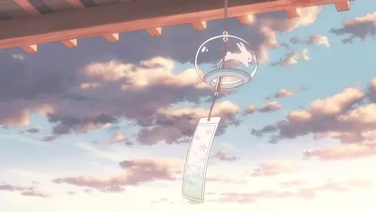
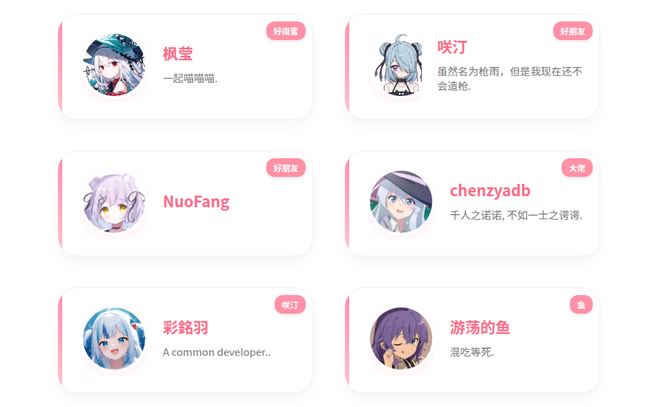
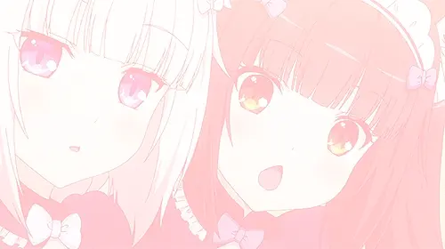
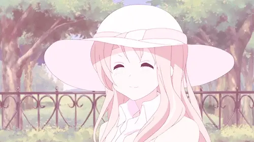
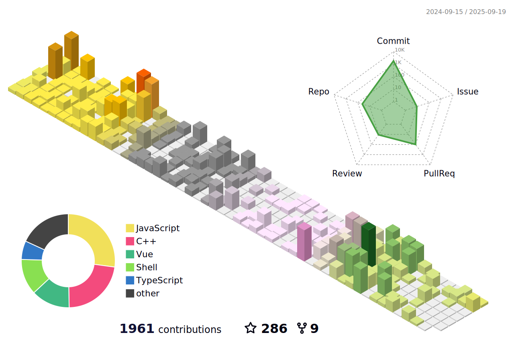

  

# ✨ 夢の魔女の魔法ノート ✨

*Ciallo～(∠・ω< )⌒★*  
こちらはコードと幻想の間を彷徨う見習い魔女です～  
*( ˘ω˘ ) 毎日新しい魔法の呪文（コード）を勉強中です！*

## 📖 魔女の日記抄録

> **「この世界はとても寛容で、3センチ高く向けられた銃口も許してくれるし、誰もが問題なく生きていけることも許してくれる。  
> 誰もあなたにこの世界を愛せとは要求しないけれど、心から自分自身を愛してほしいと願っています。」**
>
> *—— デバッグで夜明けまで過ごしたある夜、ターミナルに点滅するイレイナ様の言葉 ✨  
> その時の私は縫いぐるみを抱えて、ちょっと目が潤んでいました... (´；ω；`)*

## 🌸 一緒にお友達になりましょう！

**✨ [魔女の魔法工房を見学する → YumeYuka.plus](https://YumeYuka.plus) ✨**

*相互リンクを交換して、インターネットの星海で一緒にキラキラ輝きましょう～ (｡♥‿♥｡)  
コメントを残してくれると、とても嬉しいです！ ♪(´▽｀)*

## 🏠 魔女の温かい小屋

**💕 [魔女会に参加する](https://join.oom-wg.dev) 💕**

*魔女の小屋へようこそ、もっとたくさんの仲間と魔法とコードについて語り合いましょう！  
ここではたくさんの面白い魂に出会えますよ～ (◕‿◕)✨*

## 🎀 この小さな魔女について

**• 萌え属性：** 技術オタク + 二次元 + 軽い人見知りだけど優しい (,,•﹏•,,)  
**• 得意魔法：** フロントエンド呪文、バックエンド結界、アルゴリズム占い  
**• 好きなこと：** 可愛いコードを書く、アニメ鑑賞、可愛いものコレクション  
**• 小さな癖：** コメントに顔文字を書くのが好き、コードも感情が必要だと思ってます ♡  
**• 私の弱点：** 褒められると煙が出るほど恥ずかしくなっちゃいます～ (๑•́ ₃ •̀๑)

  

  

  
  

  <picture>
    <source media="(prefers-color-scheme: dark)" srcset="https://raw.githubusercontent.com/NightRainMilkyWay/NightRainMilkyWay/output/github-contribution-grid-snake-dark.svg">
    <source media="(prefers-color-scheme: light)" srcset="https://raw.githubusercontent.com/NightRainMilkyWay/NightRainMilkyWay/output/github-contribution-grid-snake.svg">
    
  </picture>

### 💌 最後の小さな想い

*ここまで見てくれてありがとうございます～ (´∀｀)♡  
この小さな魔女がまあまあだと思ったら、⭐️をつけてくださいね！  
一緒にコードの世界で、もっとたくさんの素敵な魔法を織りなしていきましょう～ ✨*

