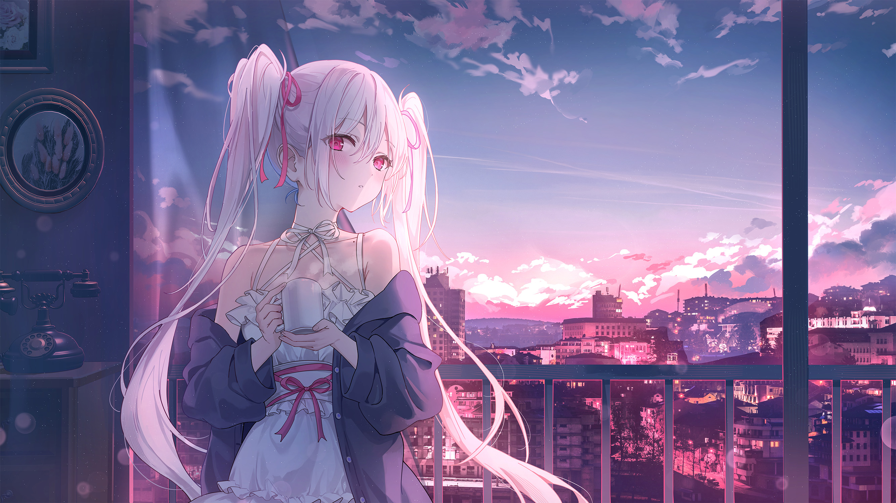

  

# ✨ 梦璃魔女的魔法笔记 ✨

*Ciallo～(∠・ω< )⌒★*  
这里是一位在代码与幻想之间徘徊的见习小魔女～  
*( ˘ω˘ ) 每天都在学习新的魔法咒语（代码）！*

## 魔女日记摘录

> [!NOTE] 笔记
> 「这世界很宽容，宽容到绝对可以允许抬高三公分的枪口，也可以宽容到每个人都可以问心无愧的活着。
> 没有人理应去要求你爱这个世界，但我由衷的希望你爱着自己。」
>
> —— 某个通宵调试的夜晚，终端里闪烁着伊蕾娜大人的话语 ✨  
> 那时的我抱着玩偶，眼眶都微微湿润了... (´；ω；`)

## 一起来做朋友吧！

**✨ [参观魔女的魔法工房 → YumeYuka.plus](https://YumeYuka.plus) ✨**

*交换友链吧，在互联网的星海中一起闪闪发光～ (｡♥‿♥｡)  
如果能留下评论，我会超级开心的！ ♪(´▽｀)*

## 魔女的温暖小屋

**[加入魔女会](https://join.oom-wg.dev)**

*欢迎来到魔女的小屋，一起和更多小伙伴聊聊魔法与代码！  
在这里你会遇见许多有趣的灵魂～ (◕‿◕)✨*

## 关于这位小魔女

  

  
  

  <picture>
    <source media="(prefers-color-scheme: dark)" srcset="https://raw.githubusercontent.com/NightRainMilkyWay/NightRainMilkyWay/output/github-contribution-grid-snake-dark.svg">
    <source media="(prefers-color-scheme: light)" srcset="https://raw.githubusercontent.com/NightRainMilkyWay/NightRainMilkyWay/output/github-contribution-grid-snake.svg">
    
  </picture>

### 最后的小小心愿

*谢谢你看到这里～ (´∀｀)♡  
如果觉得这个小魔女还不错，记得点个 ⭐️ 哦！  
让我们一起在代码的世界里，编织出更多美妙的魔法～ ✨*

