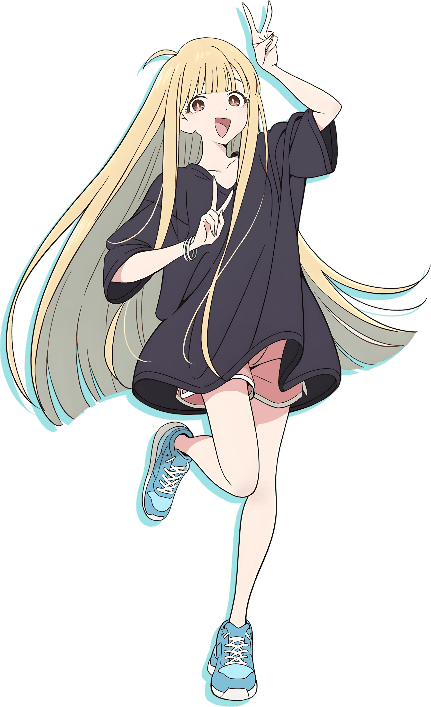

## 夢璃の小さなアトリエ

**Ciallo～(∠・ω< )⌒★** 

はじめまして、**夢璃（ユメリ / Yumeri**です（´∀｀）

コードを書くのが好きで、日常をほんの少し甘く彩りたいと思っているエンジニアです。

静かに何かを作業するのも好きだし、アニメを追うのも好きです。日々の多くはスクリーンの前で過ごしています。少し打ち込み、少し好きなものを眺めながら、二つの世界のあいだをゆっくり行き来しています（´-`）

効率を強く求めるタイプではなく、どちらかといえば過程を大切にしています。「どれだけやったか」よりも、自分が本当に好きだと思えるものを残していきたい。まだ成長の途中で、進む方向も模索中ですが、ここに少しずつ、やさしい小さな成果を積み重ねていけたらと思っています（ ´ ▽ ` ）

*本当の成長とは、過去の自分を否定することではなく、
痛みを受け入れたうえで、それでも優しさを選ぶ勇気を持つこと。*

 
 

## ちいさな実績たち

<!-- 统计和语言卡片并排显示 -->

  
  

