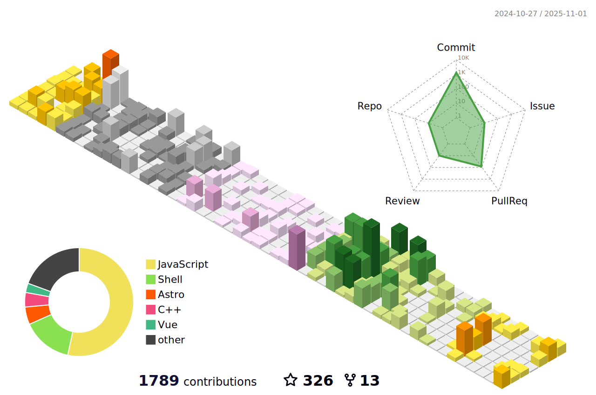

# ✨ 梦璃魔女的魔法笔记 ✨

*Ciallo～(∠・ω< )⌒★*  
我是梦璃，一名在代码与幻想之间徘徊的见习小魔女，每天都在学习新的魔法咒语（代码）！

## 魔女日记摘录

> 「这世界很宽容，宽容到绝对可以允许抬高三公分的枪口，也可以宽容到每个人都可以问心无愧的活着。
> 没有人理应去要求你爱这个世界，但我由衷的希望你爱着自己。」

## 梦璃酱的自述

一名喜欢写代码、也喜欢追番和二创的小学生  
 在代码和二次元之间徘徊，把生活调成自己喜欢的频道

  **偏爱 C++ 和 Kotlin，不喜欢 Java**
  
  **正在学习前端技术，想做出好看又实用的作品**
  
  **最喜欢的角色是 亚托莉**
  
  **偶尔玩原神，更多时候沉浸在番剧和二创里**

## 关于这位小魔女

  <!-- 上面两张图片并排 -->
  

    
    
  

  
  <!-- 下面两张图片并排 -->
  

    
    
    
  

