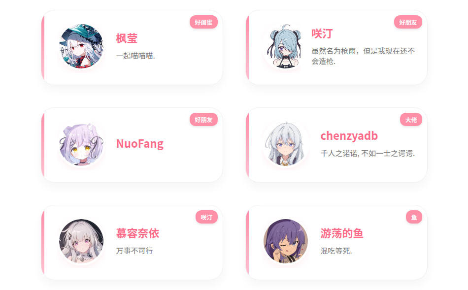
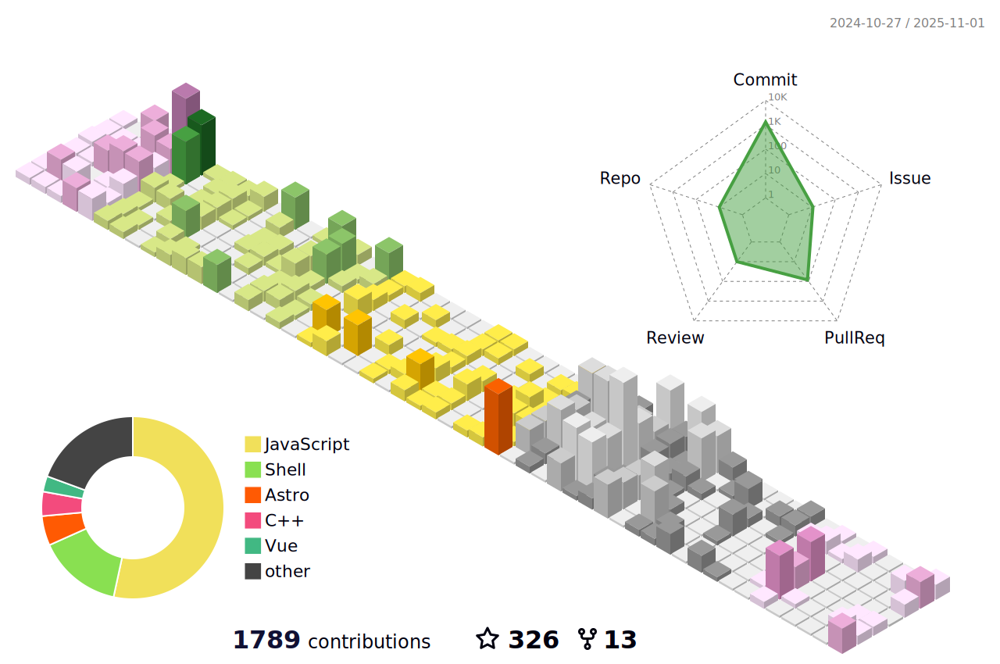

---

# 💫 梦之魔女的魔法笔记

`Ciallo～(∠・ω< )⌒★` 这里是游走在代码与幻想之间的见习魔女，伊雷娜大人的忠实学徒~

## **魔女修业中：**

    
    
    
    

#### **正在研习的古老咒语；**  

  
（偶尔会念错咒语导致程序爆炸💥）  

#### **使用的魔法杖；**

#### **未来想学习的魔法；**

## **魔法实验室：**

✧ [Suu-Nyanya](https://github.com/YumeYuka/Suu-Nyanya)  
——  试图用代码编织出会思考的魔法生物  

✧ [Tritium box](https://github.com/TimeBreeze/Tritium_box)  
—— 一个装满星光的魔法匣子，正在收集月光的能量  

## **魔女日记摘抄：**

"这世界很宽容，宽容到允许抬高三公分的枪口，也宽容到每个人都可以问心无愧地活着。没有人理应要求你爱这个世界，但我由衷希望你爱着自己。"  

——某个调试到天明的夜晚，伊雷娜大人的话语在终端闪烁  

## **和我一起成为好朋友吧**

### [点击这里](https://YumeYuka.cn)  参观魔女的魔法工坊 → YumeYuka.cn
**欢迎与我交换友链，喵喵喵~**

---

<picture>
  <source media="(prefers-color-scheme: dark)" srcset="https://raw.githubusercontent.com/NightRainMilkyWay/NightRainMilkyWay/output/github-contribution-grid-snake-dark.svg">
  <source media="(prefers-color-scheme: light)" srcset="https://raw.githubusercontent.com/NightRainMilkyWay/NightRainMilkyWay/output/github-contribution-grid-snake.svg">
  
</picture>

---

<!---
NightRainMilkyWay/NightRainMilkyWay is a ✨ special ✨ repository because its `README.md` (this file) appears on your GitHub profile.
You can click the Preview link to take a look at your changes.
--->
